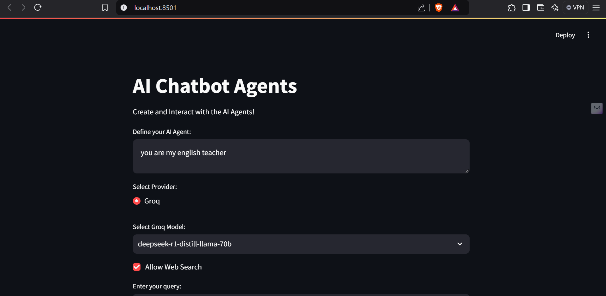
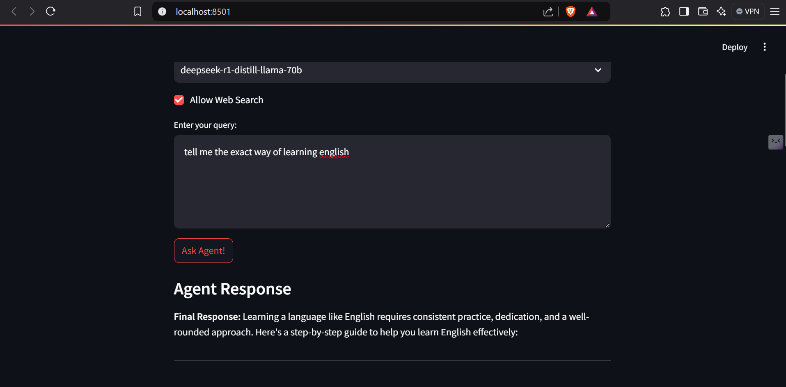
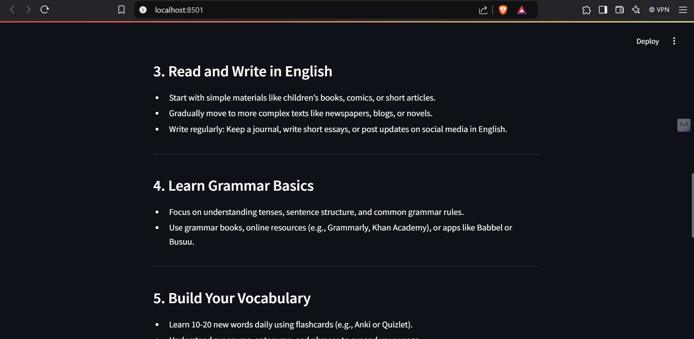
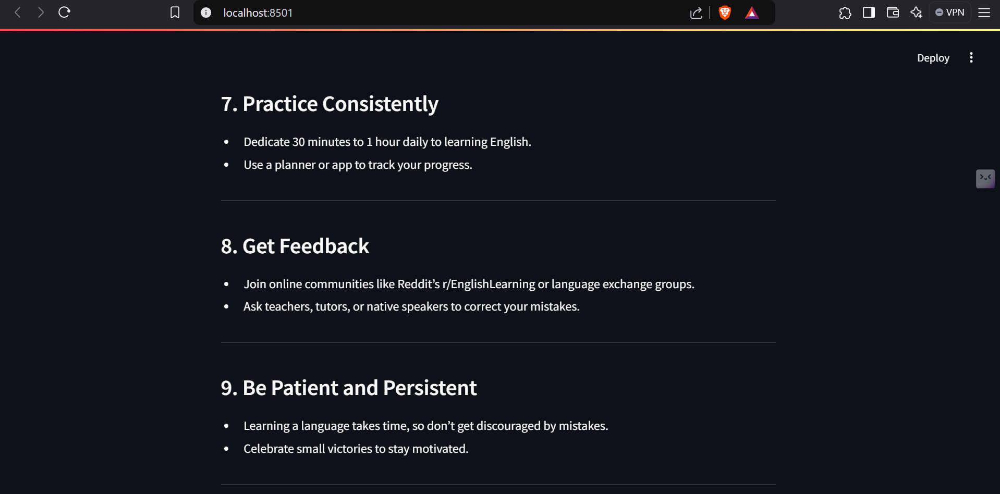
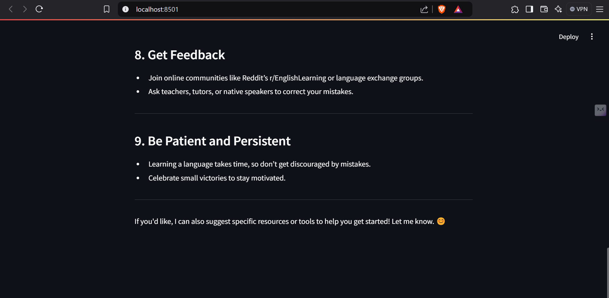

# Project Setup Guide
## Screenshots

### Screenshot 1


### Screenshot 2


### Screenshot 3


### Screenshot 4


### Screenshot 5

This guide provides step-by-step instructions to set up your project environment, including setting up a Python virtual environment using Pipenv, pip, or conda.

## Table of Contents

1. [Setting Up a Python Virtual Environment](#setting-up-a-python-virtual-environment)
   - [Using Pipenv](#using-pipenv)
   - [Using pip and venv](#using-pip-and-venv)
   - [Using Conda](#using-conda)
2. [Running the application](#project-phases-and-python-commands)


## Setting Up a Python Virtual Environment

### Using Pipenv
1. **Install Pipenv (if not already installed):**  
```
pip install pipenv
```

2. **Install Dependencies with Pipenv:** 

```
pipenv install
```

3. **Activate the Virtual Environment:** 

```
pipenv shell
```

---

### Using `pip` and `venv`
#### Create a Virtual Environment:
```
python -m venv venv
```

#### Activate the Virtual Environment:
**macOS/Linux:**
```
source venv/bin/activate
```

**Windows:**
```
venv\Scripts\activate
```

#### Install Dependencies:
```
pip install -r requirements.txt
```

---

### Using Conda
#### Create a Conda Environment:
```
conda create --name myenv python=3.11
```

#### Activate the Conda Environment:
```
conda activate myenv
```

#### Install Dependencies:
```
pip install -r requirements.txt
```


# Project Phases and Python Commands

## Phase 1: Create AI Agent
```
python ai_agent.py
```

## Phase 2: Setup Backend with FastAPI
```
python backend.py
```

## Phase 3: Setup Frontend with Streamlit
```
python frontend.py
```

## IMPORTANT
### Make sure backend python script is running in a separate terminal


